# **Instalación de Visual Studio Code e Introducción a Markdown.**


| Área           | Autor             | Autorizante        | Fecha      |
| :------------- | :---------------- | :----------------- | :--------- |
| **Ingeniería** | Fermosel, Nicolás | Garabello, Gabriel | 04/06/2025 |
|                |                   | Gorne, Gabriel     |            |


***Tabla de Contenido***

- [**Instalación de Visual Studio Code e Introducción a Markdown.**](#instalación-de-visual-studio-code-e-introducción-a-markdown)
  - [Descarga e Instalación de Visual Studio Code.](#descarga-e-instalación-de-visual-studio-code)
  - [Instalación de Extensiones.](#instalación-de-extensiones)
  - [Las Extensiones.](#las-extensiones)
    - [Extensión Markdown PDF.](#extensión-markdown-pdf)
      - [Uso](#uso)
      - [Configuración formato PDF.](#configuración-formato-pdf)
    - [Extensión Spell Checker Spanish.](#extensión-spell-checker-spanish)
      - [Uso](#uso-1)
    - [Extensión Markdown All in One para VSCode](#extensión-markdown-all-in-one-para-vscode)
      - [Uso](#uso-2)
        - [**Generar Tabla de Contenidos**:](#generar-tabla-de-contenidos)
  - [Primeros Pasos en Markdown.](#primeros-pasos-en-markdown)
    - [Introducción.](#introducción)
    - [Utilidad.](#utilidad)
    - [Aprendiendo a escribir en Markdown.](#aprendiendo-a-escribir-en-markdown)
      - [Encabezados (Títulos)](#encabezados-títulos)
      - [Negrita y Cursiva](#negrita-y-cursiva)
      - [Listas](#listas)
      - [Enlaces.](#enlaces)
      - [Imágenes.](#imágenes)
      - [Líneas Horizontales.](#líneas-horizontales)
      - [Comentarios, Mensajes Especiales.](#comentarios-mensajes-especiales)
    - [IMPORTANTE: FORMATO ENRIQUECIDO. (Flavored Markdown)](#importante-formato-enriquecido-flavored-markdown)
    - [IMPORTANTE: NOTAS ESPECIALES. (Formato enriquecido)](#importante-notas-especiales-formato-enriquecido)
    - [Modo especial para incluir imágenes. (Formato Enriquecido)](#modo-especial-para-incluir-imágenes-formato-enriquecido)
    - [Salto forzado. (Formato Enriquecido)](#salto-forzado-formato-enriquecido)


## Descarga e Instalación de Visual Studio Code.

  1. **Visita la página oficial de Visual Studio Code**: [Descargar VS Code](https://code.visualstudio.com/downloadel).
  2. **Selecciona "Windows"** y descarga el instalador.
  3. Puede ver [**este video**](https://www.youtube.com/watch?v=n_KRjULN9D8) para la instalación. (https://www.youtube.com/watch?v=n_KRjULN9D8)

<div style="page-break-after: always;"></div>

## Instalación de Extensiones.

Estas extensiones nos asisten en nuestra tarea, son importantes ya que nos ahorran mucho tiempo de trabajo.

   * Click en el símbolo de "Extensiones".
   
<div align="center">
  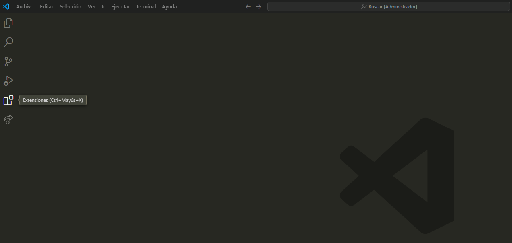
  <p><strong>Figura: 1</strong></p>
</div>

   * Escriba "Markdown" en el buscador y busque las extensiones "Markdown PDF", "Markdown All in One" y "Code Spell Checker Spanish".
   
<div align="center">
  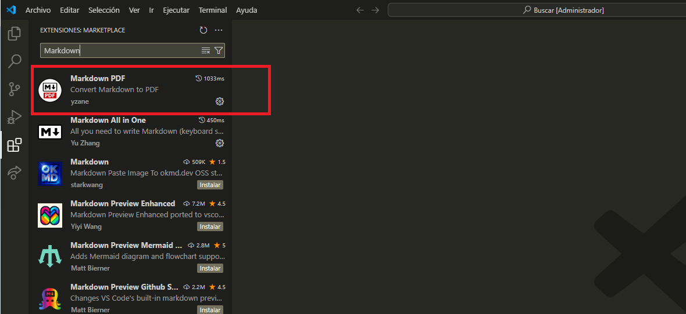
  <p><strong>Figura: 2</strong></p>
</div>

<div style="page-break-after: always;"></div>

   * Realice click en "Instalar". Realice la tarea para cada extensión.
   
 <div align="center">
  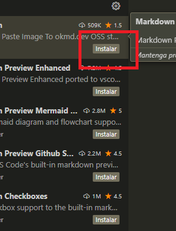
  <p><strong>Figura: 3</strong></p>
</div>

   * Ya puede comenzar a escribir documentos en Markdown.
   
   * Otra opción:
      - Ingresar a: 
        - [Markdown PDF de marketplace](https://marketplace.visualstudio.com/items?itemName=yzane.markdown-pdf)
        - [Markdown All in One de marketplace](https://marketplace.visualstudio.com/items?itemName=yzhang.markdown-all-in-one)
        - [Code Spell Checker Spanish](https://marketplace.visualstudio.com/items?itemName=streetsidesoftware.code-spell-checker-spanish)

## Las Extensiones.

Los detalles sobre las características y el uso de las Extensiones instaladas quedan a cargo de cada Usuario. Al seleccionar la extensión se muestra la info necesaria. Vea imagen a continuación.

<div align="center">
  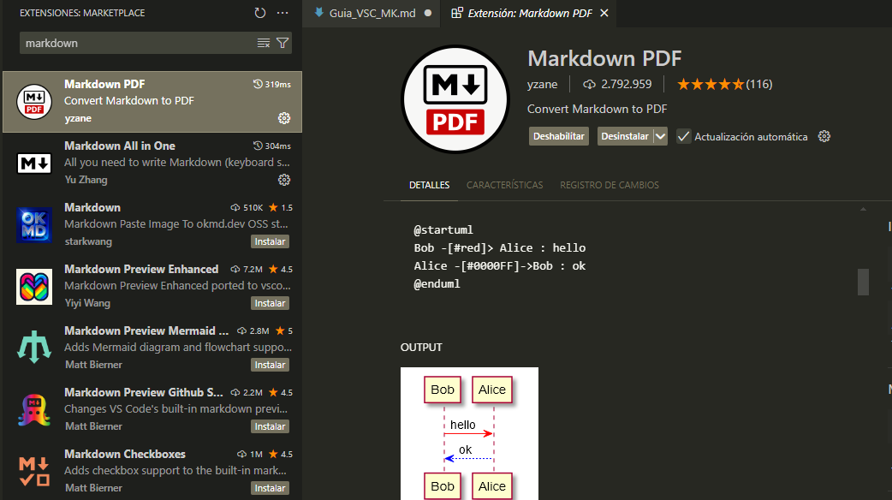
  <p><strong>Figura: 4</strong></p>
</div>

 A continuación se explicaran las acciones para configurar y realizar las tareas básicas para generar la documentación rápida.

<div style="page-break-after: always;"></div>

### Extensión Markdown PDF.

La extensión **Markdown PDF** permite convertir archivos Markdown a varios formatos, incluyendo PDF, HTML, PNG y JPEG. 

#### Uso

- **Comando**: Abre tu archivo Markdown, presiona `F1` o `Ctrl+Shift+P`, escribe `export` y selecciona el formato deseado (por ejemplo, `markdown-pdf: Export (pdf)`).

<div align="center">
  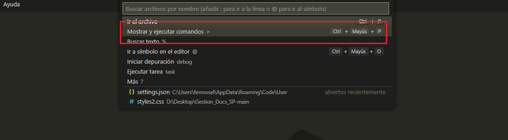
  <p><strong>Figura: 5</strong></p>
</div>

- **Menú**: También puedes hacer clic derecho en el archivo Markdown y seleccionar la opción de exportación desde el menú contextual.

<div align="center">
  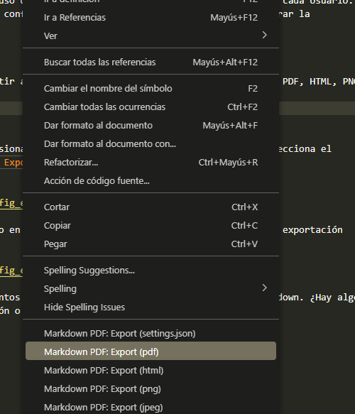
  <p><strong>Figura: 6</strong></p>
</div>

#### Configuración formato PDF.

* Ir a la barra de comandos. Vea Figura 5
* Ingresar la palabras "Preferencias" y elegir "Abrir configuración de usuario (JSON).
  
<div align="center">
  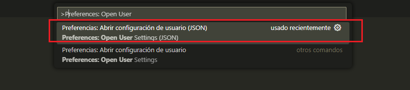
  <p><strong>Figura: 7</strong></p>
</div>

* Copiar el contenido del archivo "Archivo_JSON.txt" y pegar en el archivo "settings.json".

<div align="center">
  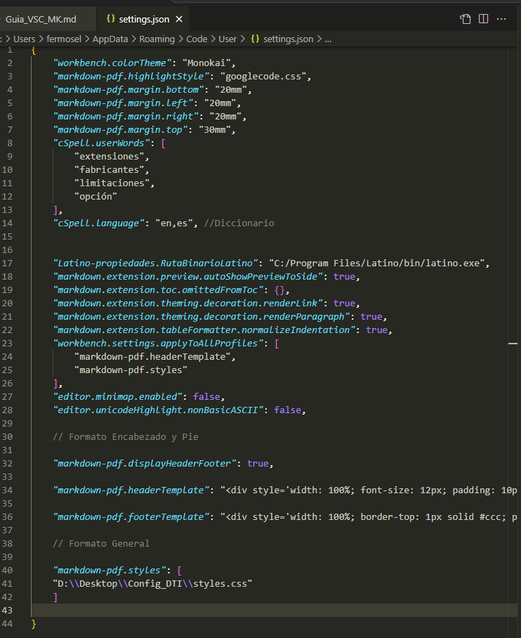
  <p><strong>Figura: 8</strong></p>
</div>

<div style="page-break-after: always;"></div>


### Extensión Spell Checker Spanish.

La extensión **Spell Checker Spanish** permite verificar la ortografía dentro de tus archivos de código y documentos.

#### Uso

- **Comando**: Abre tu archivo, presiona `F1` o `Ctrl+Shift+P`, escriba `Enable Spanish Spell Checker Dictionary` y selecciona la opción deseada. (Vea Figura 5)

- **Configuración Manual**: Añade `es` o `es-ES` a la configuración `cSpell.language` en tus preferencias (`Preferences -> Settings`). (Este paso está incluido en Configuración PDF, figura 8)


### Extensión Markdown All in One para VSCode

La extensión **Markdown All in One** proporciona todas las herramientas necesarias para trabajar con Markdown, incluyendo atajos de teclado, tabla de contenidos, vista previa automática y más. 

#### Uso

##### **Generar Tabla de Contenidos**: 
  
  - Ubicar le cursor en el lugar donde desea ubicar la Tabla de contenidos 
   
<div align="center">
  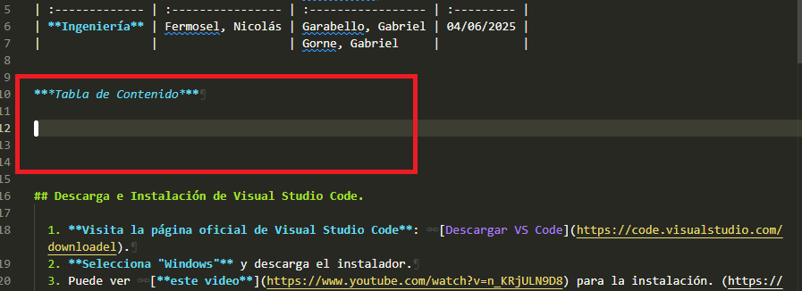
  <p><strong>Figura: 9</strong></p>
</div>

  - Ejecuta el comando `Create Table of Contents` en la paleta de comandos (vea figura 5).
  
<div align="center">
  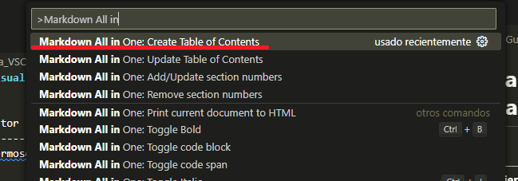
  <p><strong>Figura: 10</strong></p>
</div>
  
  -  La tabla de contenidos que se actualiza automáticamente al guardar el archivo.
  
- **Vista Previa Automática**: Activa la vista previa automática para ver cómo se verá tu documento Markdown mientras lo editas.

<div align="center">
  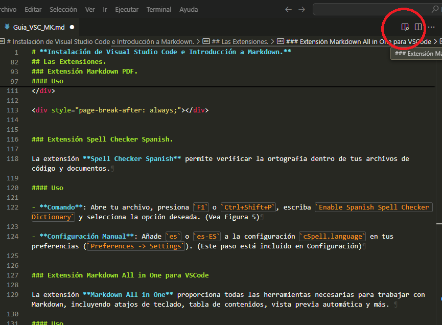
  <p><strong>Figura: 11</strong></p>
</div>


## Primeros Pasos en Markdown.

### Introducción.

Markdown es un lenguaje de marcado ligero que permite formatear texto de manera sencilla y rápida. Fue creado para facilitar la escritura de documentos en formato HTML sin necesidad de conocer profundamente el lenguaje. 


### Utilidad.

Markdown utiliza una sintaxis simple y fácil de leer, lo que lo hace ideal para escribir en blogs, foros, documentación técnica y correos electrónicos.

Con unos pocos caracteres, puedes crear encabezados, listas, enlaces, imágenes y más. Esto permite a los usuarios centrarse en el contenido sin preocuparse por el formato. Además, Markdown es compatible con muchas plataformas y herramientas, lo que facilita la colaboración y el intercambio de documentos.

### Aprendiendo a escribir en Markdown.

En unos pocos minutos se pueden aprender los conceptos básicos para generar documentos. Puede encontrar tutoriales y herramientas de asistencia en estos links:

  - Guía rápida en español: https://markdown.es/
  - Guía con algunas funciones extendidas: https://tutorialmarkdown.com/
  - Herramientas para acelerar el trabajo: https://www.markdowntools.com/

<div style="page-break-after: always;"></div>


#### Encabezados (Títulos)

Usa el símbolo de numeral `#` para los encabezados. La cantidad de numerales indica el nivel del encabezado (del 1 al 6).

  > ````markdown
  > # Encabezado 1 (el más grande, como un <h1>)
  > ## Encabezado 2 (como un <h2>)
  > ### Encabezado 3 (como un <h3>)
  > #### Encabezado 4
  > ##### Encabezado 5
  > ###### Encabezado 6

#### Negrita y Cursiva

  >**Negrita**: Usa dos asteriscos `**` o dos guiones bajos `__` alrededor del texto.
  >*Cursiva*: Usa un asterisco `*` o un guion bajo `_` alrededor del texto.
  >***Negrita y Cursiva***: Combina tres asteriscos `***`.

#### Listas

* **Listas no ordenadas (bullets)**: Usa un asterisco `*`, un guion `-` o un signo de más `+` seguido de un espacio. Para sub-elementos, indenta con dos o cuatro espacios.

    >```
    >* Primer elemento
    >* Segundo elemento
    >    * Sub-elemento 1
    >    * Sub-elemento 2
    >* Tercer elemento
    >```

* **Listas ordenadas (numeradas)**: Usa un número seguido de un punto y un espacio. Markdown es inteligente y se encargará de la numeración correcta aunque no empieces desde el 1.

   > ```
   > 1. Primer paso
   > 2. Segundo paso
   >     1. Sub-paso A
   >     2. Sub-paso B
   > 3. Tercer paso
   > ```

<div style="page-break-after: always;"></div>

#### Enlaces.

Usa corchetes para el texto del enlace y paréntesis para la URL.

  >```markdown
  >[Descargar VS Code](https://code.visualstudio.com/downloadel)

#### Imágenes.

Similar a los enlaces, pero con un signo de exclamación `!` al principio. El texto alternativo (`alt text`) se muestra si la imagen no carga.

>```markdown
>

#### Líneas Horizontales.

Usa tres o más asteriscos `***`, guiones `---`, o guiones bajos `___` en una línea separada.

  > ```markdown
  > ---
  >***
  >___

#### Comentarios, Mensajes Especiales.

Se puedo utilizar para generar los mensajes de "Nota", "Precaución", "Advertencia".

Ej:

>```
> >**Nota:** 
> >Este es el formato para una "Nota".
>```

(Aclaración: Enter + TRES espacios luego de una palabra"NOTA" generan un salto. Probar con y sin los espacios.)

<div style="page-break-after: always;"></div>

El resultado:

>**Nota:**  
>Este es el formato para una "Nota".

### IMPORTANTE: FORMATO ENRIQUECIDO. (Flavored Markdown)

El formato enriquecido de Markdown, a veces llamado "Markdown extendido", se refiere a las características adicionales que se le añaden al Markdown básico para permitir más opciones de formato. Puede consultar en:

* [Freecodecamp](https://www.freecodecamp.org/news/github-flavored-markdown-syntax-examples/)

* [Markdown guide](https://www.markdownguide.org/extended-syntax/)

###  IMPORTANTE: NOTAS ESPECIALES. (Formato enriquecido)

Aunque el formato enriquecido posee una forma de generar estas notas (vea links anteriores), quizá no se ajustan del todo a nuestras necesidades.

Para generar las notas, precauciones y advertencias se debe copiar, pegar y modificar el texto incluido en cada bloque:

>```
> <div class="nota">
>    Nota: 
>    Este es el formato para una "NOTA".
> </div>

>```
> <div class="precaucion">
>    PRECAUCIÓN: 
>    Este es el formato para una "PRECUACIÓN". 
> </div>


>```
> <div class="advertencia">
>    ADVERTENCIA: 
>    Este es el formato para una "ADVERTENCIA".
> </div>

<div style="page-break-after: always;"></div>

Resultado:

<div class="nota">
    Nota: Este es el formato para una "NOTA".
</div>

<div class="precaucion">
    PRECAUCIÓN: Este es el formato para una "PRECUACIÓN".
</div>

<div class="advertencia">
   ADVERTENCIA: Este es el formato para una "ADVERTENCIA".
</div>

### Modo especial para incluir imágenes. (Formato Enriquecido)

>```
><div align="center">
>  Imagen: Cambiar la ruta y el ancho (width) según necesites (Borrar al utilizar)
>  
>
>  Título de la imagen: Reemplazar el texto por el que corresponda (Borrar al utilizar) 
>  <p><strong>Figura X:</strong> Título de la imagen</p>
>
></div>
> ```

### Salto forzado. (Formato Enriquecido)

Útil solamente al generar el documento en PDF. Posee **fines estéticos**, nos permite realizar un salto forzado de página. Todo lo que esté ubicado posterior a este código comenzará en una nueva página.

Para la configuración que te proporcionamos, puedes colocarlo cada 40 líneas aproximadamente. Solo se debe copiar y pegar.


>```
><div style="page-break-after: always;"></div>
>```